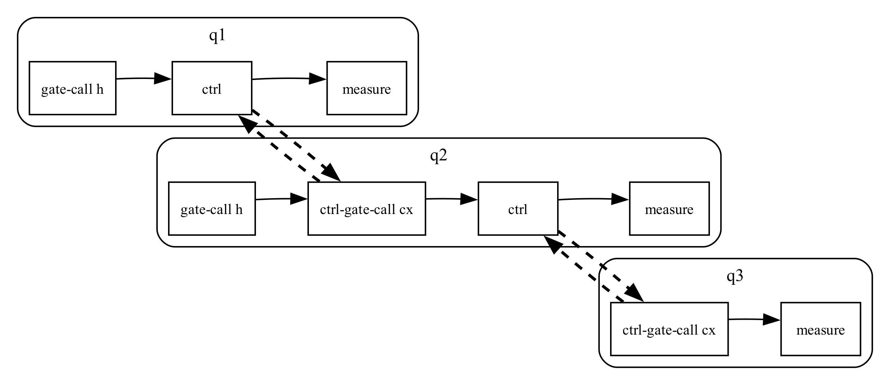
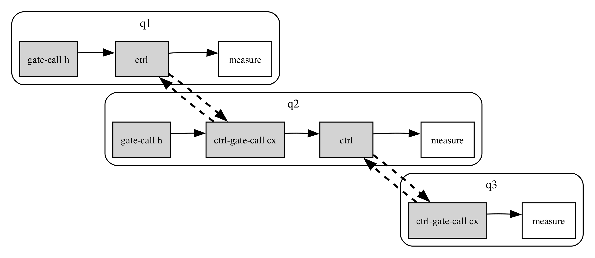
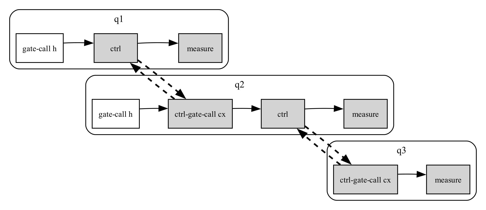

# QSlice: Quantum Program Slicing via Quantum Dependency Graphs

QSlice is an **experimental quantum program slicing framework** built on top of
**QStatic** (https://github.com/srcML/QStatic).

It enables dependency-aware analysis of quantum programs by constructing a
**Quantum Dependency Graph (QDG)** and extracting **forward and backward slices**
with respect to quantum operations.

QSlice is intended for **research and prototyping** in quantum program analysis,
change impact analysis, and program comprehension.

---

## Key Capabilities

- **Quantum Dependency Graph (QDG)**
  - Nodes represent program statements reconstructed from QStatic action records
  - Edges capture the paper's semantic dependency relations:
    - Unitary evolution dependencies (`ued`)
    - Entanglement dependencies (`ed`)
    - Measurement dependencies (`md`)
    - Classical data/control dependencies (`cd`)

- **Qubit-centric Quantum Slicing**
  - Slice with respect to a target qubit using the statement criterion Γ(q)
  - Collect semantic predecessors required to preserve the target qubit behavior
  - Legacy directed forward/backward traversals remain available for debugging

- **Graph-based Visualization**
  - Full QDG visualization
  - Slice-aware highlighting using Graphviz

> ⚠️ **Note**  
> QStatic and srcML support for OpenQASM is still evolving.
> Some XML files are manually annotated with position (`pos`) attributes.

---
## Quantum Dependency Graph Example

## Slice Examples

Backward slice (criterion: `q3` at line 11):

Forward slice (criterion: `q2` at line 10):

---
## Requirements

- Python 3.9+
- srcML
- Graphviz (`dot`)

### macOS installation
    brew install srcml graphviz

---

## Repository Structure

    .
    ├── qslice.py               QDG construction and slicing logic
    ├── parser.py               QStatic parser (from QStatic)
    ├── examples/
    │   ├── hadamard_cnot.qasm
    │   ├── hadamard_cnot.qasm.xml
    │   ├── chain3.qasm
    │   └── chain3.qasm.xml
    ├── out.json                Generated by parser.py
    ├── slice.json              Generated slice result
    └── qdg.dot / qdg.png       QDG visualization

---

## Quick Start (5 Minutes)

### 1) Parse OpenQASM and generate intermediate representation

    python3 parser.py examples/chain3.qasm.xml

This produces:
    out.json

---

### 2) Build the Quantum Dependency Graph (QDG)

    python3 qslice.py --export-dot

Render:
    dot -Tpng -Gdpi=300 qdg.dot -o qdg.png
    open qdg.png

---

### 3) Compute a Qubit-centric Quantum Slice

Example: semantic quantum slice for target qubit `q3`

    python3 qslice.py \
      --qubit q3 \
      --mode quantum \
      --export-dot \
      --dot-highlight-slice

Render:
    dot -Tpng -Gdpi=300 qdg.dot -o qdg_quantum.png
    open qdg_quantum.png

This is the default paper-aligned mode. It starts from Γ(q), the statements that
directly operate on or measure the target qubit, and computes the fixed point of
semantic predecessors over `ued`, `ed`, `md`, and `cd` edges.

---

### 4) Optional Legacy Directed Traversals

Directed traversals are still available for debugging and comparison:

    python3 qslice.py --qubit q2 --line 10 --mode backward
    python3 qslice.py --qubit q2 --line 10 --mode forward

---

## Printing a Slice in QASM-like Form

After slicing, `slice.json` contains the extracted slice.

    python3 - <<'PY'
    import json

    d=json.load(open("slice.json"))
    for stmt in d["slice_statements"]:
        qubits = ", ".join(stmt["qubits"]) or "classical"
        if stmt["action"] in {"unitary", "guarded-unitary"}:
            guard = f" if {'; '.join(stmt['conditions'])}" if stmt["conditions"] else ""
            print(f"line {stmt['line']}: {stmt['gate']} {qubits};{guard}")
        elif stmt["action"] == "measure":
            stores = ", ".join(stmt["stores"]) or "?"
            print(f"line {stmt['line']}: measure {qubits} -> {stores};")
        elif stmt["action"] == "reset":
            print(f"line {stmt['line']}: reset {qubits};")
        else:
            print(f"line {stmt['line']}: {stmt['action']} {qubits};")
    PY

---

## Conceptual Model

- Nodes: source-level program statements reconstructed by grouping per-qubit actions with the same `(time, line)`
- `ued` edges: uninterrupted unitary evolution on a qubit until measurement or reset
- `ed` edges: semantic influence from multi-qubit unitary operations to later accesses of the entangled qubits
- `md` edges: prior quantum evolution that influences a measurement outcome
- `cd` edges: classical data/control influence, including measurement-driven guarded quantum execution
- Quantum slice: the qubit-centric semantic predecessor fixed point from Γ(q)

---

## Status and Scope

QSlice is a **research prototype** intended for:

- exploring quantum slicing semantics
- studying dependency propagation via entanglement
- serving as a foundation for quantum change impact analysis (CIA)

It is **not** a production compiler or simulator.

---

## Relationship to QStatic

QSlice **builds on top of QStatic**:
- QStatic provides parsing and low-level action extraction
- QSlice introduces dependency modeling, slicing, and visualization

QSlice does **not replace** QStatic — it extends it.

---
## License

This project is licensed under the **GNU General Public License v3.0 (GPL-3.0)**.

See the [LICENSE](LICENSE) file for details.

